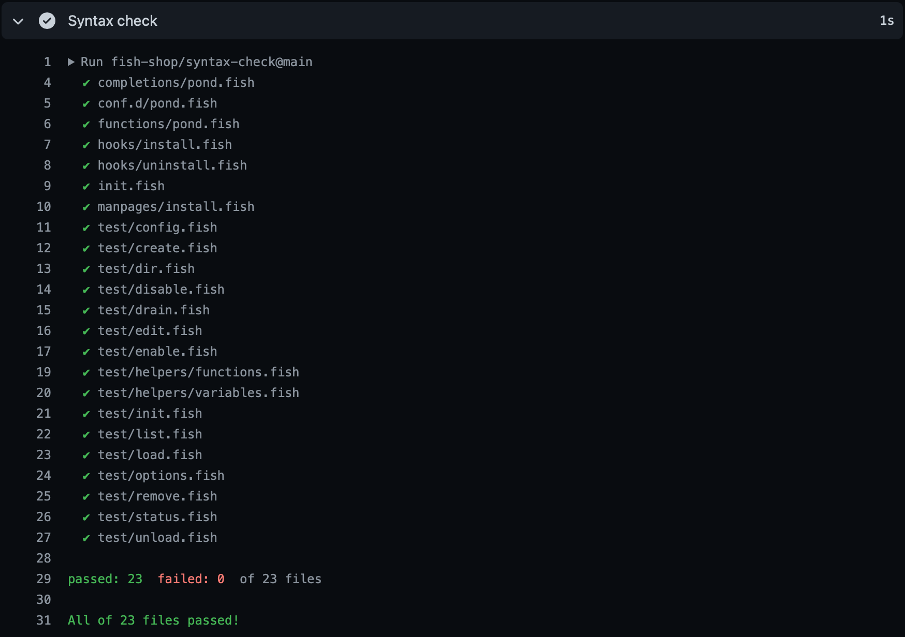

# fish-shop/syntax-check

[](http://opensource.org/licenses/mit-license.php) [](https://fishshell.com) [](https://github.com/fish-shop/syntax-check/issues)

A GitHub action for syntax checking [fish shell](https://fishshell.com) files.



## Usage

Add a suitable `uses` step to your GitHub [workflow](https://docs.github.com/en/actions/reference/workflow-syntax-for-github-actions) as shown below:

```yaml
jobs:
  syntax-check:
    runs-on: ubuntu-latest
    steps:
      - name: Syntax check
        uses: fish-shop/syntax-check@1.0.0
```

By default, all files under `$GITHUB_WORKSPACE` with a `.fish` file extension are checked. To specify a different file pattern to match against specify a value for the `pattern` input. For example, to check all `.fish` files in the `src` directory of your repository:

```yaml
...
steps:
  - name: Syntax check
    uses: fish-shop/syntax-check@1.0.0
    with:
      pattern: src/**.fish
```

## Acknowledgements

* This project was inspired by [fish-actions/syntax-check](https://github.com/fish-actions/syntax-check).

## License
`fish-shop/syntax-check` is provided under the terms of the [MIT License](http://opensource.org/licenses/mit-license.php).

## Contact
Email me at [marc.ransome@fidgetbox.co.uk](mailto:marc.ransome@fidgetbox.co.uk) or tweet [@marcransome](http://www.twitter.com/marcransome).
